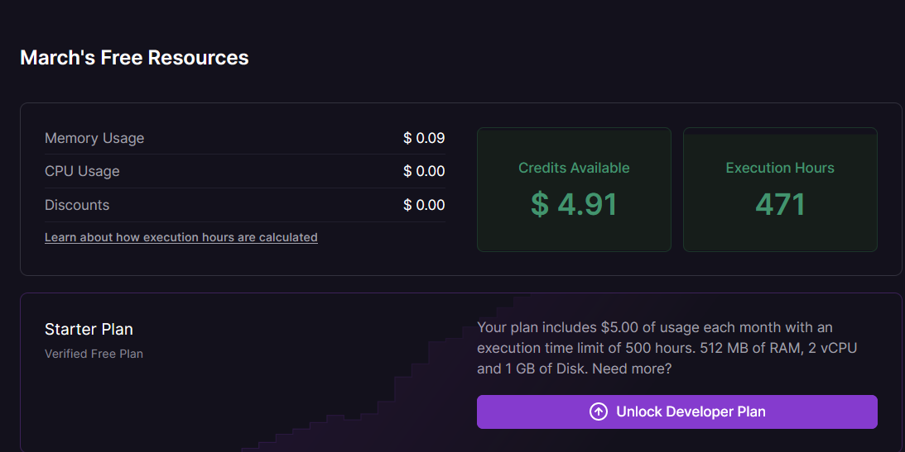
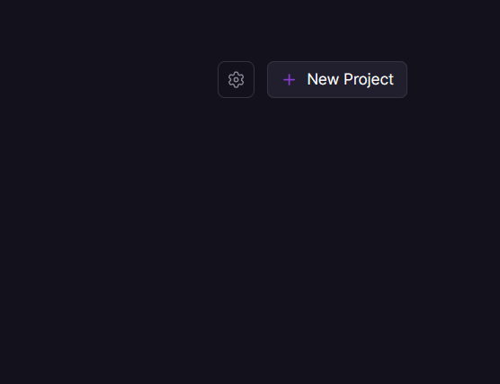
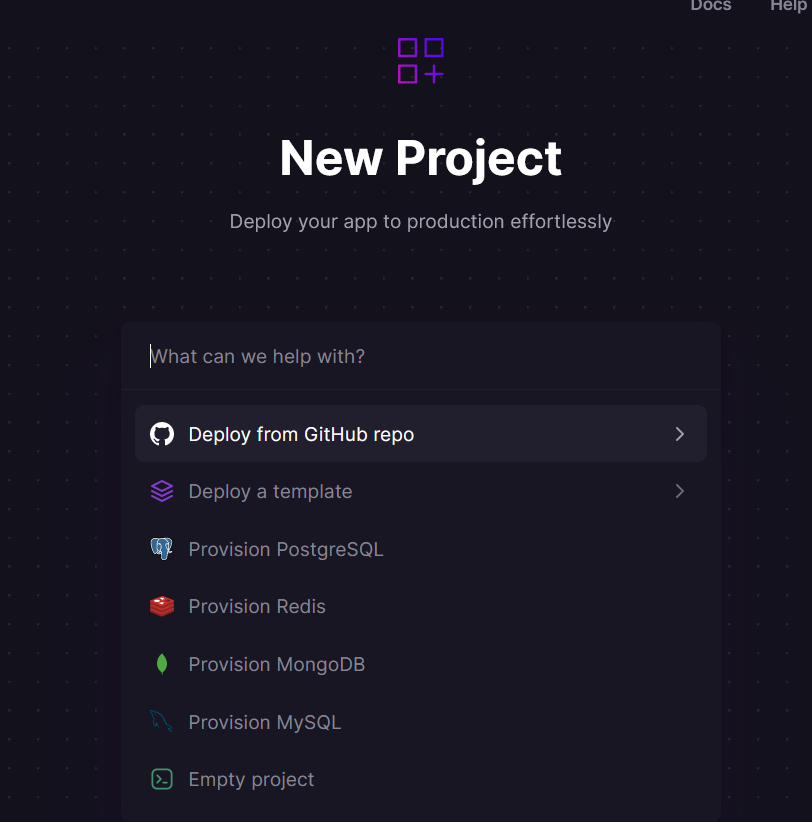
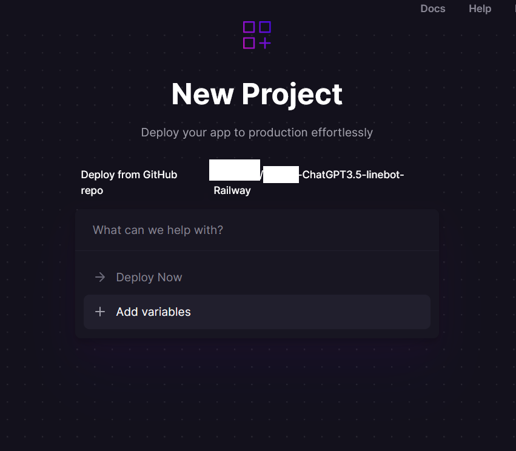
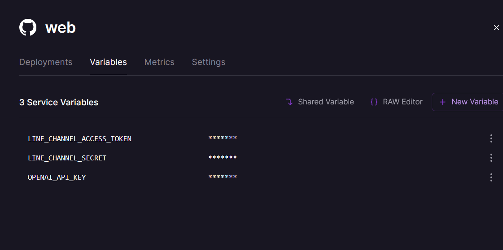
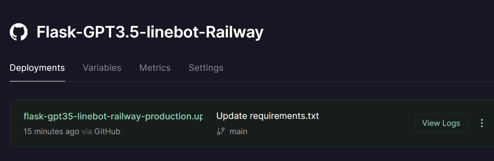
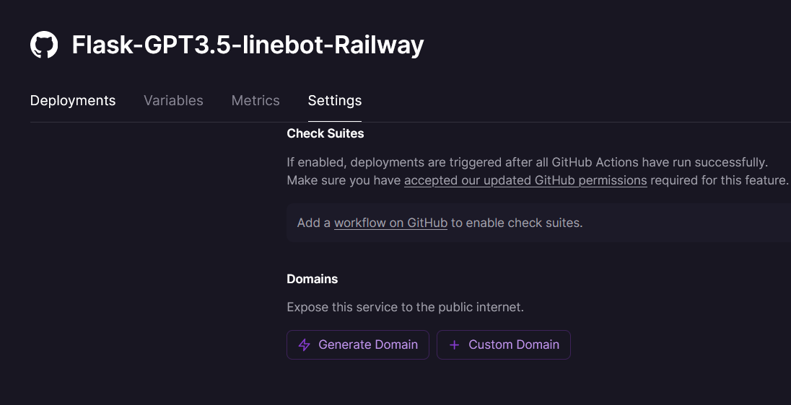

# FastAPI-ChatGPT3.5-linebot-Railway
# 一個使用FastAPI框架和GPT3.5 turbo模型官方API，創造一個linebot，快速建置於平台Railway。

## [TelegramBot Vercel GPT3.5 turbo/ChatGPT版本部署](https://github.com/pyfbsdk59/Flask-official-ChatGPT-TelegramBot-Vercel)

  

## [TelegramBot Render GPT3版本部署](https://github.com/pyfbsdk59/Flask-ChatGPT-TelegramBot-Render)

  

## [LineBot Django Vercel GPT3版本部署](https://github.com/pyfbsdk59/Django-ChatGPT-linebot-Vercel)

  

## [TelegramBot Golang Render GPT3版本部署](https://github.com/pyfbsdk59/Golang-ChatGPT-TelegramBot-Render)

  

  

## [LineBot Golang Render GPT3版本部署](https://github.com/pyfbsdk59/Golang-ChatGPT-linebot-Render)

  

### [English](https://github.com/pyfbsdk59/Flask-GPT3.5-linebot-Railway/blob/main/README_en.md)
### [日本語](https://github.com/pyfbsdk59/Flask-GPT3.5-linebot-Railway/blob/main/README_jp.md)

#### GPT3 TelegramBot Vercel部署版本。程式猿影音教學參考。請支持且訂閱加按讚感謝他的辛勞。

https://www.youtube.com/watch?v=eKKEa6NhCd0

  

#### 0. Railway提供免費Starter Plan，每個月有5美元或500小時執行時間的免費額度。所以一個月大概可以用20天上下。不用時請刪掉專案。只要存活著就會計算時間。據官方網站說，服務不會沉睡。

  

#### 1. 註冊Railway帳號後，開啟新專案New Project，匯入import已經fork過來的本專案。

  

  

#### 2. 必須在專案的Variables設定3個環境變數，分別是OPENAI_API_KEY和LINE_CHANNEL_SECRET和LINE_CHANNEL_ACCESS_TOKEN。部署成功後，會出現網址，請到LINE developer網頁設定Webhook URL。
例如：https://xxxxx.railway.app/callback

  

  

  

#### 3. 若沒有出現網址，請到settings裡的Domains做設定，按下generate domain按鈕即可。

  

------
### Line和openai api設置請參考： https://github.com/howarder3/GPT-Linebot-python-flask-on-vercel